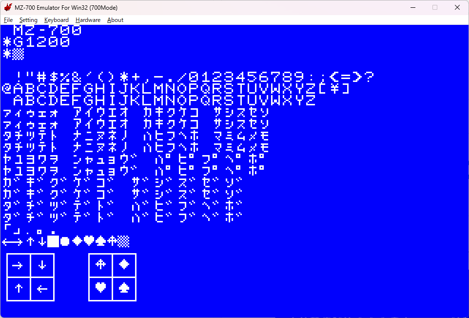
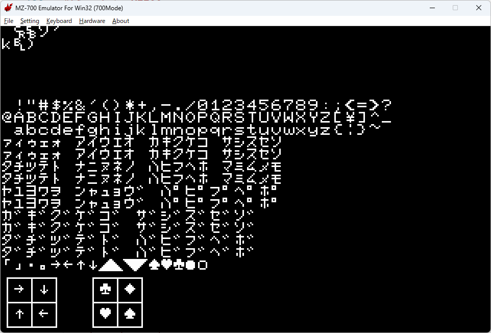

# AILZ80ASM charmap for MZ-700 and PC-8001

## はじめに

https://github.com/AILight/AILZ80ASM で公開されているZ80アセンブラには CHARMAP 
という素敵な機能があります。
この機能は DB 疑似命令で文字列を定義する際に文字列内の各文字をあらかじめ定義しておいてマップ
（辞書、ハッシュテーブル）に基づいて変換するものです。

そこで、SHARP MZ-700 用の CHARMAP を作成してみました。この CHARMAP を使用することで、
- アセンブラソース上では通常のキャラクタコードを使用し文字列を定義
- アセンブル時にキャラクタコードからディスプレイコードに変換
- アセンブル結果としてディスプレイコードを出力

することができ、アセンブラソースの可読性向上が期待できます。

なお、本 CHARMAP では、全角文字からの変換を定義しているので、
アセンブラソース上で後述の例のような罫線文字を利用した
画面を目視可能な状態で記述することができます。

## CHARMAP 定義内容

本 CHARMAP でディスプレイコードに置き換え可能な文字は次のとおりです。

- ASCII 0x20(`␣`) から 0x5D(`]`)。英小文字は英大文字にマップ
- 上述の ASCII の全角文字
- MZ-700 で利用可能な半角カタカナとカナ記号
- 上述の半角カタカナ、カナ記号に対応する全角カタカナ、全角ひらがな、全角記号
- 全角カタカナ、全角ひらがなの濁点文字、半濁点文字
    - 濁点文字、半濁点文字は2つのディスプレイコードに分解されます。
    - ゛, ゜ 単独でもマップしているので、正確なレイアウトにするには
    ソースレベルで2文字で定義するのが良いでしょう。
- MZ-700 で利用可能な記号の一部（矢印、罫線、▩等）
- ASCII 範囲の全角英数記号を除く一覧は次のとおりです。
```
 !"#$%&'()*+,-./0123456789:;<=>?
@ABCDEFGHIJKLMNOPQRSTUVWXYZ[\]
 abcdefghijklmnopqrstuvwxyz
ぁぃぅぇぉ　あいうえお　かきくけこ　さしすせそ
ァィゥェォ　アイウエオ　カキクケコ　サシスセソ
たちつてと　なにぬねの　はひふへほ　まみむめも
タチツテト　ナニヌネノ　ハヒフヘホ　マミムメモ
やゆよわを　んゃゅょゔ　ぱぴぷぺぽ
ヤユヨワヲ　ンャュョヴ　パピプペポ
がぎぐげご　ざじずぜぞ
ガギグゲゴ　ザジズゼゾ
だぢづでど　ばびぶべぼ
ダヂヅデド　バビブベボ
「」・。．
←→↑↓■●◆♥♠♣▩
╋┗┛┣┻┏┓┫┳━┃
┼└┘├┴┌┐┤┬─│
```

## 使用方法

1. 本リポジトリの [mz700.json](mz700.json) をアセンブラソースと同じフォルダに保存する。
2. アセンブラソース上で
    - CHARMAP を定義する。
    - ~~DB 疑似命令で~~文字列リテラルを定義する際、定義したCHARMAP を適用する。


__注意__ 
- json の保存場所は変更できると思いますが、方法詳細については AILZ80ASM のドキュメントを参照してください。
- ソースファイルのエンコーディングが utf8 でない場合の挙動は確認していません。


## 使用例

```
    ; charmap の定義
    charmap @MZ700,"mz700.json"

    ; charmap の適用
    db  @MZ700:"HELLO MZ-700!"
    ld  a, @MZ700:"@"
```
## マップ作成、定義の削除・追加について

- CHARMAP 作成は [charmap.py](charmap.py)で行っています。
- 定義を修正するにはこのスクリプトを修正するか、直接 [mz700.json](mz700.json) を修正します。
- このスクリプトを実行すると、動作確認用アセンブラソース [charmap_test.asm](charmap_test.asm) も生成します。

## 動作確認用アセンブラソースと実行結果

- ソース [charmap_test.asm](charmap_test.asm)
- 実行結果


## ライセンス

[MIT](LICENSE) 

## ~~おまけ: mz700fon.txt グリフ定義の課題~~

**本項の記載は誤っていました。
AKD さんのサイトの記載の作成方法のままで
正しいグリフのフォントを作成することができます。<br>
情報をいただいた AKD さんに感謝します。**

~~AKDさんのサイト
[MZ-700WIN,EmuZ-700/1500フォントデータの作成](http://mzakd.cool.coocan.jp/starthp/subpage15.html)
で説明されているフォントファイルですが、
ディスプレイコードとグリフが入れ替わっているものがあります。~~

~~このファイルを元にフォントファイルを作成する場合、
#x0b9 と #x0ba の定義内容を入れ替えてください。~~

~~変更後の内容を次に示します。~~


## おまけ2：PC-8001 用 CHARMAP

とある理由で欲しくなったので作成しました。

アセンブラのコマンドラインでのラベル定義と、
条件アセンブルで次のように MZ700/PC8001 でソースを共通化できるかも？


```
PRINT_XYC 9, 24, 7, "　　　　　　　　┏━┓"
PRINT_XYC 9, 24, 7, "　　　　　　　　┃８┃"
PRINT_XYC 9, 24, 7, "　　　　　┏━┓┗━┛┏━┓"
PRINT_XYC 9, 24, 7, "ＬＥＦＴ　┃４┃　＋　┃６┃　ＲＩＧＨＴ"
PRINT_XYC 9, 24, 7, "　　　　　┗━┛　　　┗━┛"
```

### 定義内容

- 0x20-0x7E の英数記号およびその全角文字
- 0xa1-0ef の半角カナおよびのその全角カタカナ、全角ひらがな
- 全角濁点、半濁点カタカナ、ひらがな
- 罫線、記号

```
円年月日時分秒
→←↑↓
╋┼┻┴┳┬┫┤┣├━─┃│┏┌┓┐┗└┛┘
◢◣◥◤♠♥♦◆♣●〇■
```

### 使用方法

python charmap_n80.py を実行すｋると、n80.json が作成されるので
適当な名前をつけて CHARMAP を定義、適用します。

```
    charmap @N80,"n80.json"
    db   @N80:"「」・。→←↑↓◢◣◥◤♠♥♣●〇",0xff
    db   @N80:"┏━┳━┓  ┌─┬─┐",0xff
    db   @N80:"┃→┃↓┃  │♣│◆│",0xff
    db   @N80:"┣━╋━┫  ├─┼─┤",0xff
    db   @N80:"┃↑┃←┃  │♥│♠│",0xff
    db   @N80:"┗━┻━┛  └─┴─┘",0xff
```

### 動作確認用アセンブラソースと実行結果

charmap_n80_test.asm を -dl MZ700 としてアセンブルし、
フォントファイルの後半を PC-8001 相当のものに差替えて、
mz700win で実行したものになります。



