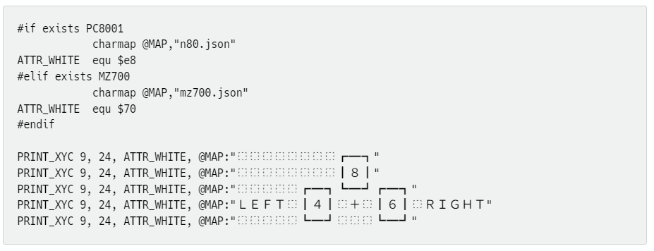

# MZ-700 CHARAMAP for AILZ80ASM

## はじめに

https://github.com/AILight/AILZ80ASM で公開されているZ80アセンブラには CHARAMAP 
という素敵な機能があります。
この機能は DB 疑似命令で文字列を定義する際に文字列内の各文字をあらかじめ定義しておいてマップ
（辞書、ハッシュテーブル）に基づいて変換するものです。

そこで、SHARP MZ-700 用の CHARAMAP を作成してみました。この CHARAMAP を使用することで、
- アセンブラソース上では通常のキャラクタコードを使用し文字列を定義
- アセンブル時にキャラクタコードからディスプレイコードに変換
- アセンブル結果としてディスプレイコードを出力

することができ、アセンブラソースの可読性向上が期待できます。

なお、本 CHARAMAP では、全角文字からの変換を定義しているので、
アセンブラソース上で後述の例のような罫線文字を利用した
画面を目視可能な状態で記述することができます。

### CHARAMAP 定義内容

本 CHARAMAP でディスプレイコードに置き換え可能な文字は次のとおりです。

- ASCII 0x20(`␣`) から 0x5D(`]`)。英小文字は英大文字にマップ
- 上述の ASCII の全角文字
- MZ-700 で利用可能な半角カタカナとカナ記号
- 上述の半角カタカナ、カナ記号に対応する全角カタカナ、全角ひらがな、全角記号
- 全角カタカナ、全角ひらがなの濁点文字、半濁点文字
    - 濁点文字、半濁点文字は2つのディスプレイコードに分解されます。
    - ゛, ゜ 単独でもマップしているので、正確なレイアウトにするには
    ソースレベルで2文字で定義するのが良いでしょう。
- MZ-700 で利用可能な記号の一部（矢印、罫線、▩等）
- ASCII 範囲の全角英数記号を除く一覧は次のとおりです。
```
 !"#$%&'()*+,-./0123456789:;<=>?
@ABCDEFGHIJKLMNOPQRSTUVWXYZ[\]
 abcdefghijklmnopqrstuvwxyz
ぁぃぅぇぉ　あいうえお　かきくけこ　さしすせそ
ァィゥェォ　アイウエオ　カキクケコ　サシスセソ
たちつてと　なにぬねの　はひふへほ　まみむめも
タチツテト　ナニヌネノ　ハヒフヘホ　マミムメモ
やゆよわを　んゃゅょゔ　ぱぴぷぺぽ
ヤユヨワヲ　ンャュョゔ　パピプペポ
がぎぐげご　ざじずぜぞ
ガギグゲゴ　ザジズゼゾ
だぢづでど　ばびぶべぼ
ダヂヅデド　バビブベボ
「」・。．
←→↑↓■●◆♥♠▩
┏┳━┓  ┌─┬┐
┣╋━┫  │　││
┃┃　┃  ├─┼┤
┗┻━┛  └─┴┘
```

## 使用方法

1. 本リポジトリの [mz700.json](mz700.json) をアセンブラソースと同じフォルダに保存する。(※)
2. アセンブラソース上で
    - CHARAMAP を定義する。
    - DB 疑似命令で文字列リテラルを定義する際、定義したCHARAMAP を適用する。

※ json の保存場所は変更できると思いますが、方法詳細については AILZ80ASM のドキュメントを
参照してください。

## 使用例

```
    ; charamap の定義
    charamap @MZ700,"mz700.json"

    ; charamap の適用
    db   @MZ700:"HELLO MZ-700!"
```
## マップ作成、定義の削除・追加について

- CHARAMAP 作成は [charmap.py](charmap.py)で行っています。
- 定義を修正するにはこのスクリプトを修正するか、直接 [mz700.json](mz700.json) を修正します。
- このスクリプトを実行すると、動作確認用アセンブラソース [charamap_test.asm](charamap_text.asm) も生成します。


## 動作確認用アセンブラソース実行結果

[charmp_test.asm](charamap_test.asm) 実行結果です。

